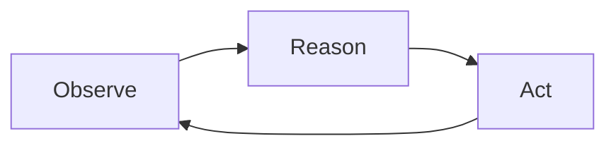

ARC-AGI-3 consists of **135 turn-based games** split across three datasets.

| Dataset | Game Count | Description |
|---|---|---|
| **Public**         | 25 | Freely accessible games for demonstration, local development, prototyping and testing. You can [try them yourself](https://arcprize.org/tasks?v=3) to see the benchmark in action.
| **Semi-Private**   | 55 | Held-out games used to evaluate models behind external APIs subject to a small risk of data leakage.
| **Fully Private**  | 55 | Tightly guarded test set reserved exclusively for final competition scoring under strict rules.

<Info>Public games are deliberately simpler and do not cover the full range of mechanics found in the private sets to reduce the risk of targeted training.</Info>

### Games vs Levels
Each game consists of multiple levels, which introduces additional spatial and temporal complexity:

- **Games** are completely independent microworlds. The visual objects, the use of colors, mechanics, and goals of one game share nothing with the next.
- **Levels** are stages within a single game. They share underlying rules, but introduce progressively harder mechanics, obstacles and layouts.

Solving a game requires an agent to master and remember the rules established in earlier levels and apply them in increasingly challenging situations.
Levels also introduce a significant challenge during competition, when failing any level means starting over from level 1.

---

## The Interaction Loop

Interaction is strictly turn-based. At each step, the agent engages in a loop of observation, reasoning, and action:

Interaction proceeds step-by-step: the agent observes the visual frame, selects an action, and the environment transitions to a new state.
The exact information given to an agent at every step is covered on the [Observations Page](/theory/observations).

---

## Visual Discovery

Each game presents the agent with a visual environment represented as a 64x64 grid of colored cells, like the one shown below.

The agent is not told what those cells mean - it has to infer everything from interaction. It has to discover:
- **Objects and Their Roles:** Objects may consist of clusters of cells of the same or different colors. The agent must identify them and discover their roles through interaction.
- **Color Semantics:** The meanings of colors vary between games, but environments convey meaning through color. In the example frame above, a yellow "donut" is tightly connected to the yellow bar.
- **Action Dynamics:** How each action influences the environment and what is within agent's influence.
- **World Mechanics:** Rules that govern how objects interact and move (e.g., gravity, collisions).
- **The Win Condition:** The environment does not declare what "success" is. The agent must infer what constitutes a win or a loss by observing the environment.

Success in ARC-AGI-3 requires an agent to approach solving the environments as a scientific process: observing state changes,
building causal models, formulating hypotheses, testing them through targeted actions, and drawing conclusions about win conditions.

Playing the [games](https://arcprize.org/tasks?v=3) yourself makes this process clear: you can observe how you discover the rules and figure out what it
takes to win.
